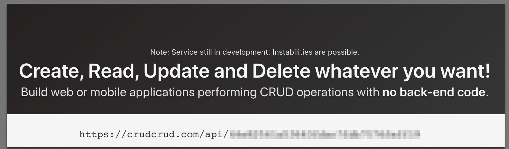
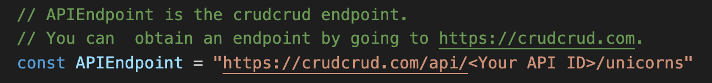
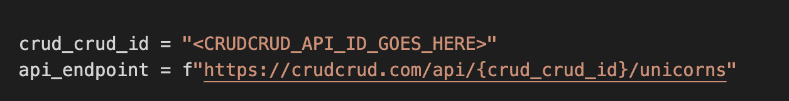

# unicorn-maker
Unicorn-maker is a complete example of a Cloudformation provider. This resource is built in multiple languages, to get you up and running creating Cloudformation custom resources.

The [CloudFormation Command Line Interface (CLI)](https://docs.aws.amazon.com/cloudformation-cli/latest/userguide/what-is-cloudformation-cli.html) is an open-source tool that enables you to develop and test AWS and third-party resources and register them for use in AWS CloudFormation. Begin by going to the [documentation guide](https://docs.aws.amazon.com/cloudformation-cli/latest/userguide/resource-type-setup.html) and setting up your build environment.

## Examples
This example resource is built in the following languages:

- Go

- Python

- Java (Comming soon)

## Getting started
- Once you have set up your development environment, obtain a CrudCurd API key. Don't worry; the free version provides more than enough requests to play with this example.

- Pick one of the language examples for this repo.
- Add the API key to the source file.
    - (Go) 
    - (Python) 

- Submit the resource using the Cloudformation CLI
- After the provider has been registered, deploy it using the sample Cloudformation `cloudformation.json`

## Contract test
This example was create using Cloudformation's best practices. Therefore, it will pass all of the Cloudformation CLI's Contract test.
To run the contrast test, follow the directions the
[documentation.](https://docs.aws.amazon.com/cloudformation-cli/latest/userguide/resource-type-cli-test.html)

